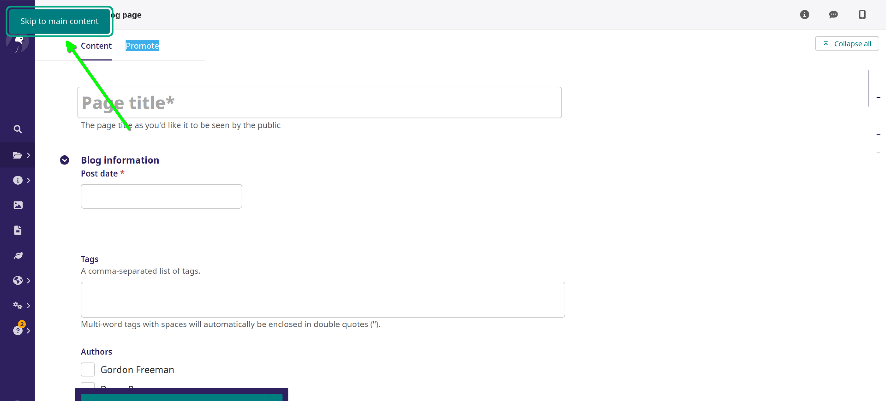

### The Skip Link

Wagtail's **skip link** lets users of assistive technology go to the main content of a web page. This link is invisible and at the top of the web page. To access the **skip link** , once the site loads, start by clicking the `Tab` key on your keyboard. The skip link is the first link your tab selection encounters as you navigate onto the page. Once the **skip link**  is in focus, hit the `Enter` key to navigate directly to the main content of the page.

